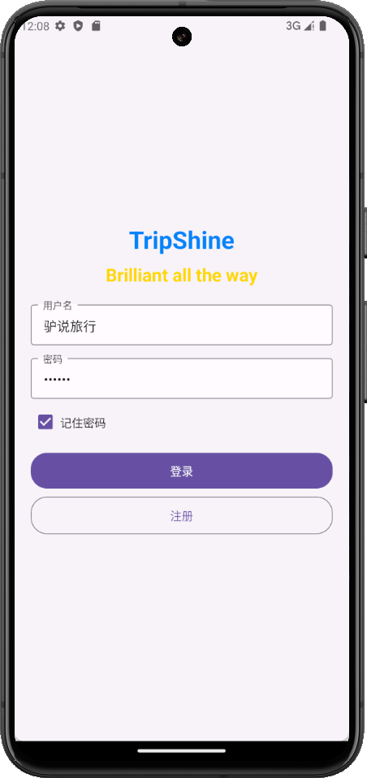
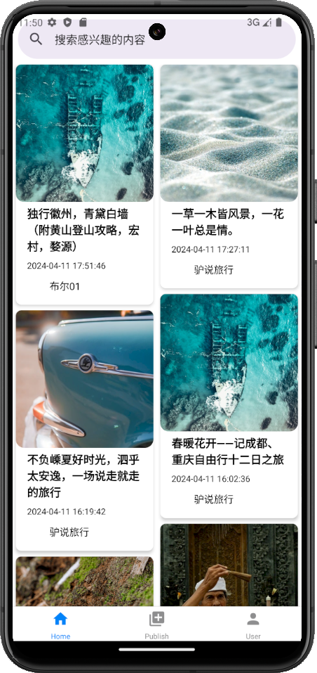
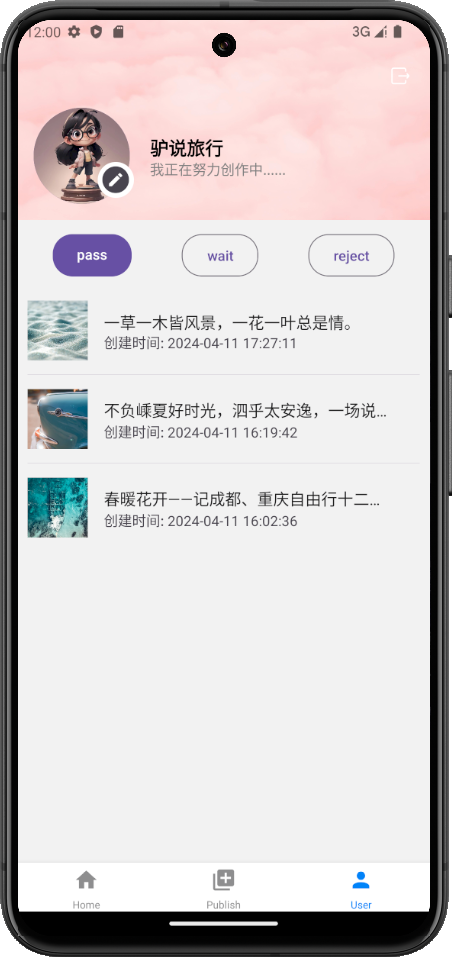
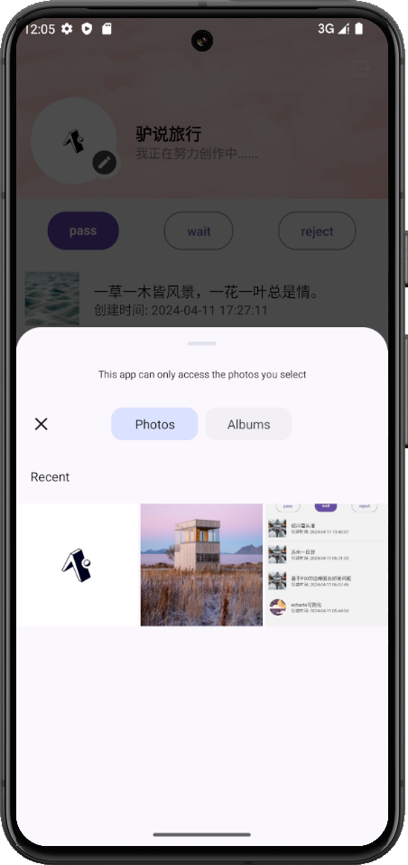
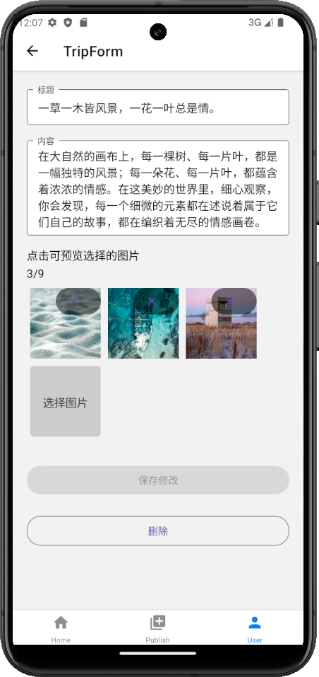
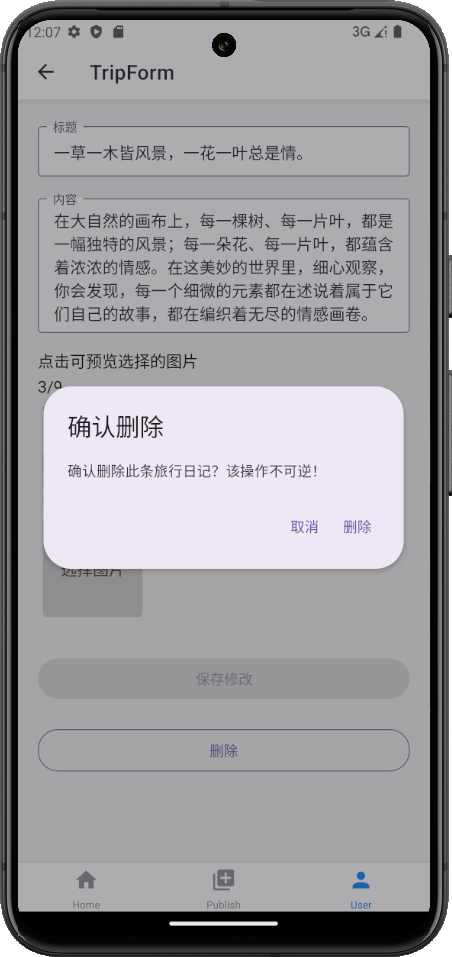

## Trip Shine 旅游日记平台

### 项目简介

Trip Shine 是一个旅游日记平台，用户可以在上面记录自己的旅行经历，分享自己的旅行故事，也可以查看他人的旅行日记，获取旅行灵感。Trip Shine 旨在为用户提供一个记录旅行经历、分享旅行故事、获取旅行灵感的平台。

### 项目成员

- 上海大学 杨盟佳
- 上海大学 杨琪琪

### 项目架构

Trip Shine 采用前后端分离的架构，前端使用 React 框架，后端使用 node.js 框架。前端和后端通过 RESTful API 进行通信。

- 文件夹结构
  - trip-shine
    - trip-app 移动端代码
    - trip-express 后端代码
    - trip-admin 管理后台代码
    - img 项目效果图片
    - README.md

### git 提交规范

- feat: 新功能 (例如 feat: 增加 xxx 功能)
- fix: 修复 bug
- del: 删除文件
- upd: 更新

### 项目管理平台

任务分工和进度管理使用以下工具：

- 飞书 Tower 协作 TripShineSHU 团队
- [Trello](https://trello.com/b/WmLRRX9r/tripshine)

### 项目文档

- [飞书文档](https://gwijz8ymrk1.feishu.cn/wiki/FkfFww58MiBM2LkYkWbc2kIUnig?from=from_copylink)

### 效果展示

#### 移动端

- 登录
  - 
- 首页
  - 
- 日记详情
  - 
- 发布须知
  - 
- 发布日记
  - 
- 个人中心
  - 
- 拒绝列表
  - 
- 修改头像
  - 
- 修改游记
  - 
- 删除游记
  - 

#### 管理后台

- 登录
  - 
- 审核列表
  - 
- 审核详情
  - 
- 审核拒绝
  - 
- 状态筛选
  - 
- 管理员列表
  - 
- 新增管理员
  - 
- 重置密码
  - 
